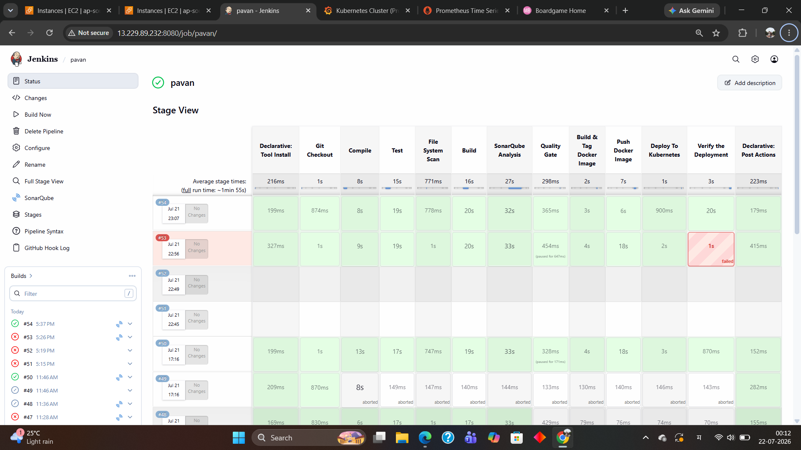

# BoardgameListingWebApp

## Description

**Board Game Database Full-Stack Web Application.**
This web application displays lists of board games and their reviews. While anyone can view the board game lists and reviews, they are required to log in to add/ edit the board games and their reviews. The 'users' have the authority to add board games to the list and add reviews, and the 'managers' have the authority to edit/ delete the reviews on top of the authorities of users.  

Project Architecture

GitHub → Jenkins Server → Maven Build → SonarQube Analysis → Docker Build → Docker Hub → Kubernetes Master → Kubernetes Worker Node → Prometheus → Grafana

## Servers Used in This Project

| Server                 | Purpose                                                   |
| ---------------------- | --------------------------------------------------------- |
| Jenkins Server         | CI/CD pipeline automation                                 |
| SonarQube Server       | Code quality analysis                                     |
| Nexus Server           | Artifact repository management                            |
| Kubernetes Master Node | Cluster management and deployment                         |
| Kubernetes Worker Node | Runs application pods                                     |
| Grafana Server         | Monitoring dashboard visualization                        |
| Prometheus             | Installed inside Kubernetes Master using Jenkins pipeline |

---

## AWS Security Group Configuration

Open the following ports in the respective EC2 Security Groups:

| Service        | Port        | Purpose                   |
| -------------- | ----------- | ------------------------- |
| SSH            | 22          | Remote server access      |
| Jenkins        | 8080        | Jenkins Web UI            |
| SonarQube      | 9000        | SonarQube Web UI          |
| Nexus          | 8081        | Nexus Web UI              |
| Grafana        | 3000        | Grafana Dashboard         |
| Prometheus     | 9090        | Prometheus Web UI         |
| Node Exporter  | 9100        | Node metrics              |
| Kubernetes API | 6443        | Kubernetes cluster access |
| NodePort Range | 30000-32767 | Kubernetes services       |

# 1. Jenkins Server Setup


## Server Requirements

* **OS:** Ubuntu 22.04 LTS
* **Instance Type:** t3.medium or higher
* **RAM:** Minimum 4 GB
* **Storage:** Minimum 20 GB

## Update System

```bash
sudo apt update
sudo apt upgrade -y
```

## Install Java 17

```bash
sudo apt install openjdk-17-jdk -y
java -version
```

## Install Jenkins

```bash
sudo apt install fontconfig openjdk-17-jre -y

wget -O /usr/share/keyrings/jenkins-keyring.asc \
https://pkg.jenkins.io/debian-stable/jenkins.io-2023.key

echo "deb [signed-by=/usr/share/keyrings/jenkins-keyring.asc] \
https://pkg.jenkins.io/debian-stable binary/" | sudo tee \
/etc/apt/sources.list.d/jenkins.list > /dev/null

sudo apt update
sudo apt install jenkins -y
```

## Start Jenkins

```bash
sudo systemctl enable jenkins
sudo systemctl start jenkins
sudo systemctl status jenkins
```

## Get Jenkins Initial Password

```bash
sudo cat /var/lib/jenkins/secrets/initialAdminPassword
```

Access Jenkins at:

```text
http://<JENKINS-PUBLIC-IP>:8080
```

## Install Maven

```bash
sudo apt install maven -y
mvn -version
```

## Install Docker

```bash
sudo apt install docker.io -y
sudo systemctl enable docker
sudo systemctl start docker
sudo systemctl status docker
```

## Add Jenkins User to Docker Group

```bash
sudo usermod -aG docker jenkins
sudo systemctl restart jenkins
```

## Install Trivy

```bash
sudo apt install wget apt-transport-https gnupg lsb-release -y

wget -qO - https://aquasecurity.github.io/trivy-repo/deb/public.key | sudo apt-key add -

echo deb https://aquasecurity.github.io/trivy-repo/deb $(lsb_release -sc) main | \
sudo tee /etc/apt/sources.list.d/trivy.list

sudo apt update
sudo apt install trivy -y
trivy --version
```

---

# 2. SonarQube Server Setup

## Server Requirements

* **OS:** Ubuntu 22.04 LTS
* **Instance Type:** t3.medium or higher
* **RAM:** Minimum 4 GB
* **Storage:** Minimum 20 GB

## Update System

```bash
sudo apt update
sudo apt upgrade -y
```

## Install Java 17

```bash
sudo apt install openjdk-17-jdk -y
java -version
```

## Install SonarQube

```bash
wget https://binaries.sonarsource.com/Distribution/sonarqube/sonarqube-10.6.0.92116.zip

sudo apt install unzip -y

unzip sonarqube-10.6.0.92116.zip

sudo mv sonarqube-10.6.0.92116 /opt/sonarqube
```

## Create SonarQube User

```bash
sudo useradd sonar

sudo chown -R sonar:sonar /opt/sonarqube
```

## Configure SonarQube Service

```bash
sudo nano /etc/systemd/system/sonarqube.service
```

Add the following content:

```ini
[Unit]
Description=SonarQube service
After=syslog.target network.target

[Service]
Type=forking
User=sonar
Group=sonar
ExecStart=/opt/sonarqube/bin/linux-x86-64/sonar.sh start
ExecStop=/opt/sonarqube/bin/linux-x86-64/sonar.sh stop
Restart=always

[Install]
WantedBy=multi-user.target
```

## Start SonarQube

```bash
sudo systemctl daemon-reload

sudo systemctl enable sonarqube

sudo systemctl start sonarqube

sudo systemctl status sonarqube
```

Access SonarQube at:

```text
http://<SONARQUBE-PUBLIC-IP>:9000
```

Default credentials:

* **Username:** admin
* **Password:** admin

---

# 3. Nexus Server Setup

## Server Requirements

* **OS:** Ubuntu 22.04 LTS
* **Instance Type:** t3.medium or higher
* **RAM:** Minimum 4 GB
* **Storage:** Minimum 20 GB

## Update System

```bash
sudo apt update
sudo apt upgrade -y
```

## Install Java 17

```bash
sudo apt install openjdk-17-jdk -y
java -version
```

## Install Nexus Repository

```bash
wget https://download.sonatype.com/nexus/3/latest-unix.tar.gz

tar -xvf latest-unix.tar.gz

sudo mv nexus-* /opt/nexus

sudo mv sonatype-work /opt/sonatype-work
```

## Create Nexus User

```bash
sudo useradd nexus

sudo chown -R nexus:nexus /opt/nexus

sudo chown -R nexus:nexus /opt/sonatype-work
```

## Configure Nexus Service

```bash
sudo nano /etc/systemd/system/nexus.service
```

Add the following content:

```ini
[Unit]
Description=Nexus Repository Manager
After=network.target

[Service]
Type=forking
User=nexus
Group=nexus
ExecStart=/opt/nexus/bin/nexus start
ExecStop=/opt/nexus/bin/nexus stop
Restart=on-abort

[Install]
WantedBy=multi-user.target
```

## Start Nexus

```bash
sudo systemctl daemon-reload

sudo systemctl enable nexus

sudo systemctl start nexus

sudo systemctl status nexus
```

Access Nexus at:

```text
http://<NEXUS-PUBLIC-IP>:8081
```

## Get Nexus Initial Admin Password

```bash
sudo cat /opt/sonatype-work/nexus3/admin.password
```

---

# 4. Kubernetes Master Node Setup

## Server Requirements

* **OS:** Amazon Linux 2023
* **Instance Type:** t3.medium or higher
* **RAM:** Minimum 4 GB
* **Storage:** Minimum 20 GB

## Update System

```bash
sudo dnf update -y
```

## Install Docker

```bash
sudo dnf install docker -y

sudo systemctl enable docker

sudo systemctl start docker

sudo systemctl status docker
```

## Install Kubernetes Tools

```bash
cat <<EOF | sudo tee /etc/yum.repos.d/kubernetes.repo
[kubernetes]
name=Kubernetes
baseurl=https://pkgs.k8s.io/core:/stable:/v1.31/rpm/
enabled=1
gpgcheck=1
gpgkey=https://pkgs.k8s.io/core:/stable:/v1.31/rpm/repodata/repomd.xml.key
EOF

sudo dnf install -y kubelet kubeadm kubectl

sudo systemctl enable --now kubelet
```

## Disable Swap

```bash
sudo swapoff -a
```

## Initialize Kubernetes Master

```bash
sudo kubeadm init --pod-network-cidr=192.168.0.0/16
```

## Configure kubectl

```bash
mkdir -p $HOME/.kube

sudo cp -i /etc/kubernetes/admin.conf $HOME/.kube/config

sudo chown $(id -u):$(id -g) $HOME/.kube/config
```

## Install Calico Network Plugin

```bash
kubectl apply -f https://raw.githubusercontent.com/projectcalico/calico/v3.29.0/manifests/calico.yaml
```

## Verify Cluster

```bash
kubectl get nodes

kubectl get pods -A
```

---

# 5. Kubernetes Worker Node Setup

## Server Requirements

* **OS:** Amazon Linux 2023
* **Instance Type:** t3.medium or higher
* **RAM:** Minimum 4 GB
* **Storage:** Minimum 20 GB

## Update System

```bash
sudo dnf update -y
```

## Install Docker

```bash
sudo dnf install docker -y

sudo systemctl enable docker

sudo systemctl start docker

sudo systemctl status docker
```

## Install Kubernetes Tools

```bash
cat <<EOF | sudo tee /etc/yum.repos.d/kubernetes.repo
[kubernetes]
name=Kubernetes
baseurl=https://pkgs.k8s.io/core:/stable:/v1.31/rpm/
enabled=1
gpgcheck=1
gpgkey=https://pkgs.k8s.io/core:/stable:/v1.31/rpm/repodata/repomd.xml.key
EOF

sudo dnf install -y kubelet kubeadm kubectl

sudo systemctl enable --now kubelet
```

## Disable Swap

```bash
sudo swapoff -a
```

## Join Worker Node to Cluster

Run the **kubeadm join** command generated by the master node.

Example:

```bash
sudo kubeadm join <MASTER-IP>:6443 --token <TOKEN> \
--discovery-token-ca-cert-hash sha256:<HASH>
```

Verify from the master node:

```bash
kubectl get nodes
```

---

# 6. Grafana Server Setup

## Server Requirements

* **OS:** Ubuntu 22.04 LTS
* **Instance Type:** t3.medium or higher
* **RAM:** Minimum 2 GB
* **Storage:** Minimum 10 GB

## Update System

```bash
sudo apt update
sudo apt upgrade -y
```

## Install Grafana

```bash
sudo apt install -y software-properties-common wget

wget -q -O - https://packages.grafana.com/gpg.key | sudo apt-key add -

echo "deb https://packages.grafana.com/oss/deb stable main" | \
sudo tee /etc/apt/sources.list.d/grafana.list

sudo apt update

sudo apt install grafana -y
```

## Start Grafana

```bash
sudo systemctl enable grafana-server

sudo systemctl start grafana-server

sudo systemctl status grafana-server
```

Access Grafana at:

```text
http://<GRAFANA-PUBLIC-IP>:3000
```

Default credentials:

* **Username:** admin
* **Password:** admin

---

# 7. Prometheus Installation Through Jenkins Pipeline

In this project, **Prometheus was not installed manually**. It was installed automatically inside the **Kubernetes Master Node** using a **Jenkins pipeline** with Helm.

## Jenkins Pipeline Stage for Prometheus & Grafana

```groovy
stage('Install Prometheus & Grafana') {
    steps {
        withKubeConfig(credentialsId: 'k8-cred',
                       serverUrl: 'https://<MASTER-IP>:6443') {
            sh '''
                if ! command -v helm > /dev/null; then
                  curl https://raw.githubusercontent.com/helm/helm/main/scripts/get-helm-3 | bash
                fi

                helm repo add prometheus-community https://prometheus-community.github.io/helm-charts
                helm repo update

                helm upgrade --install monitoring prometheus-community/kube-prometheus-stack \
                  --namespace monitoring \
                  --create-namespace

                kubectl patch svc monitoring-grafana -n monitoring \
                  -p '{"spec":{"type":"NodePort"}}'

                kubectl patch svc monitoring-kube-prometheus-prometheus -n monitoring \
                  -p '{"spec":{"type":"NodePort"}}'

                kubectl get svc -n monitoring
            '''
        }
    }
}
```

## Verify Installation

```bash
kubectl get pods -n monitoring

kubectl get svc -n monitoring
```

---

# 8. Access URLs

| Service       | URL                                               |
| ------------- | ------------------------------------------------- |
| Jenkins       | `http://<JENKINS-PUBLIC-IP>:8080`                 |
| SonarQube     | `http://<SONARQUBE-PUBLIC-IP>:9000`               |
| Nexus         | `http://<NEXUS-PUBLIC-IP>:8081`                   |
| Grafana       | `http://<GRAFANA-PUBLIC-IP>:3000`                 |
| Prometheus    | `http://<MASTER-PUBLIC-IP>:<PROMETHEUS-NODEPORT>` |
| BoardGame App | `http://<WORKER-PUBLIC-IP>:<APP-NODEPORT>`        |

---
